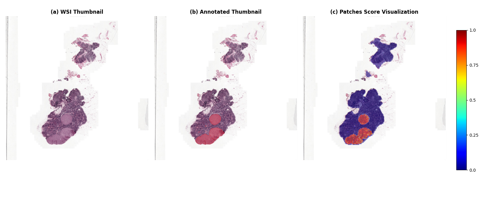

# RMIL: Recurrent Multiple Instance Learning for Whole Slide Image Analysis

PyTorch implementation of Recurrent Multiple Instance Learning (RMIL) models for whole slide image classification and analysis. This project extends the original DSMIL framework with various recurrent architectures including GRU, LSTM, Mamba, and TTT (Token-to-Token Transformer).

## Overview

This repository implements multiple recurrent MIL architectures for WSI analysis:

- **RMIL-GRU**: GRU-based recurrent MIL with intelligent patch selection
- **RMIL-LSTM**: LSTM-based recurrent MIL with attention mechanisms  
- **RMIL-Mamba**: State space model-based MIL for long sequence modeling
- **RMIL-TTT**: Token-to-Token Transformer MIL with linear/MLP variants

## Key Features

- Multiple recurrent MIL architectures for WSI analysis
- Intelligent patch selection with hybrid strategies
- Cross-validation and train/valid/test evaluation schemes
- Support for multiple datasets (TCGA, Camelyon16, custom datasets)
- Comprehensive visualization tools for WSI patch analysis
- WandB integration for experiment tracking
- Flexible model parameter configuration via JSON

## Installation

### Prerequisites
- Python 3.8+
- PyTorch 1.8+
- CUDA (for GPU training)

### Setup
```bash
# Clone repository
git clone https://github.com/XXXXXX/xxx.git
cd xxx

# Install mamba
pip install -e requirements/causal_conv1d
pip install -e requirements/mamba-1p1p1

# Install other dependencies
pip install -r requirements/requirements.txt
```

## Dataset Preparation

### Download the complete datasets

1. **[Amazon CLI](https://docs.aws.amazon.com/cli/latest/userguide/cli-chap-welcome.html)**: To download
   the [CAMELYON16 dataset](https://camelyon16.grand-challenge.org/Data/)'s raw whole-slide
   images, you'll need the AWS CLI. Install it by:

    ```bash
    curl "https://awscli.amazonaws.com/awscli-exe-linux-x86_64.zip" -o "awscliv2.zip"
    unzip awscliv2.zip
    ./aws/install

    # download the whole CAMELYON16 dataset to `./CAMELYON16`
    aws s3 sync s3://camelyon-dataset/CAMELYON16 ./CAMELYON16/ --no-sign-request
    ```

2. **[GDC Client](https://gdc.cancer.gov/access-data/gdc-data-transfer-tool)** (For downloading
   the [TCGA dataset](https://portal.gdc.cancer.gov/projects/TCGA-LUAD)):
   This is automatically downloaded and installed when you use the `scripts/download_tcga_lung.sh` script, just execute the command below:

   ```bash
    bash scripts/download_tcga_lung.sh
   ```

### Download the features extracted

You can also download the features of WSIs that we extracted from the TCGA-Lung and CAMELYON16 from [Google Drive](https://drive.google.com/drive/folders/1DwcElWRUvOjeMNUfskDKJ_r5gvowFlxC?usp=sharing).

### Dataset Structure
```
datasets/
├── mydatasets/
│   ├── TCGA-lung/
│   │   ├── pt_files/          # Feature vectors (.pt files)
│   │   └── TCGA.csv           # Dataset labels
│   └── CAMELYON16/
│       ├── pt_files/          # Feature vectors (.pt files)
│       └── Camelyon16.csv     # Dataset labels
```

## Training

### Basic Training Commands

**Train on TCGA Lung dataset:**
```bash
python train.py --model rmil_gru --dataset_dir datasets/mydatasets/TCGA-lung --label_file TCGA.csv
```

**Train on Camelyon16 dataset:**
```bash
python train.py --model rmil_gru --dataset_dir datasets/mydatasets/CAMELYON16 --label_file Camelyon16.csv --num_classes 2
```

## Visualization

Generate patch-level score visualizations for WSI analysis:

```bash
python visualization.py \
    --model rmil_gru \
    --model_weights weights/best_model.pth \
    --wsi_id tumor_016 \
    --wsi_format tif \
    --wsi_dir ./sample_wsi
```

The visualization script supports:
- Red color mapping (deep red for positive, light red for negative)
- Custom patch sizes and transparency
- Multiple WSI formats
- Batch processing capabilities



## Acknowledgement

This codebase is built on the work of [Snuffy](https://github.com/jafarinia/snuffy), [dsmil-wsi](https://github.com/binli123/dsmil-wsi), [PrePATH](https://github.com/birkhoffkiki/PrePATH), [Vim](https://github.com/hustvl/Vim), [ttt-lm-pytorch](https://github.com/test-time-training/ttt-lm-pytorch)

## Citation

If you use this code in your research, please cite:

```bibtex

```


